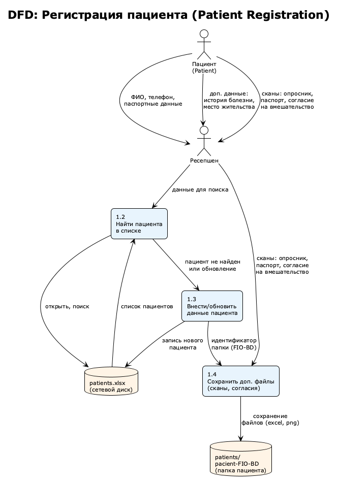
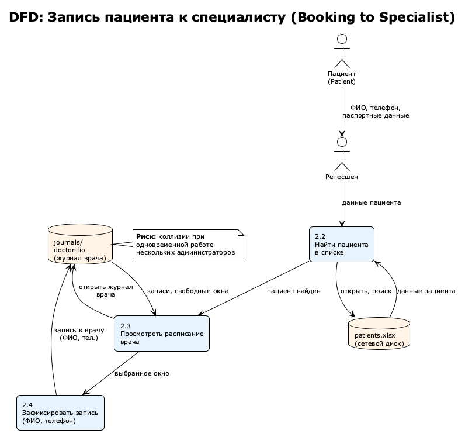
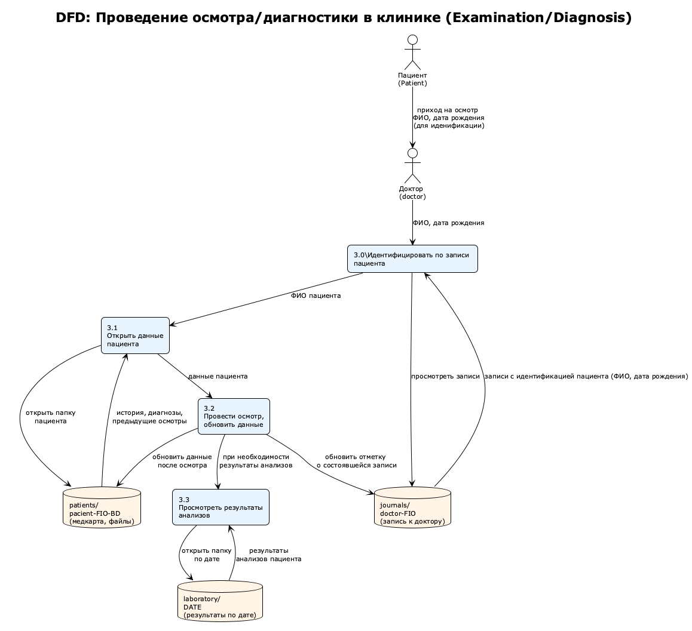
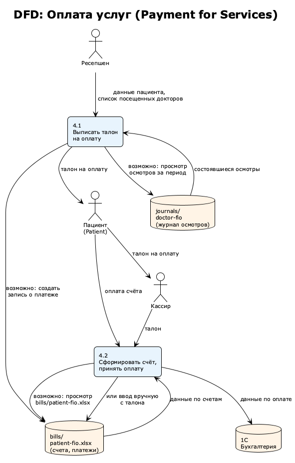
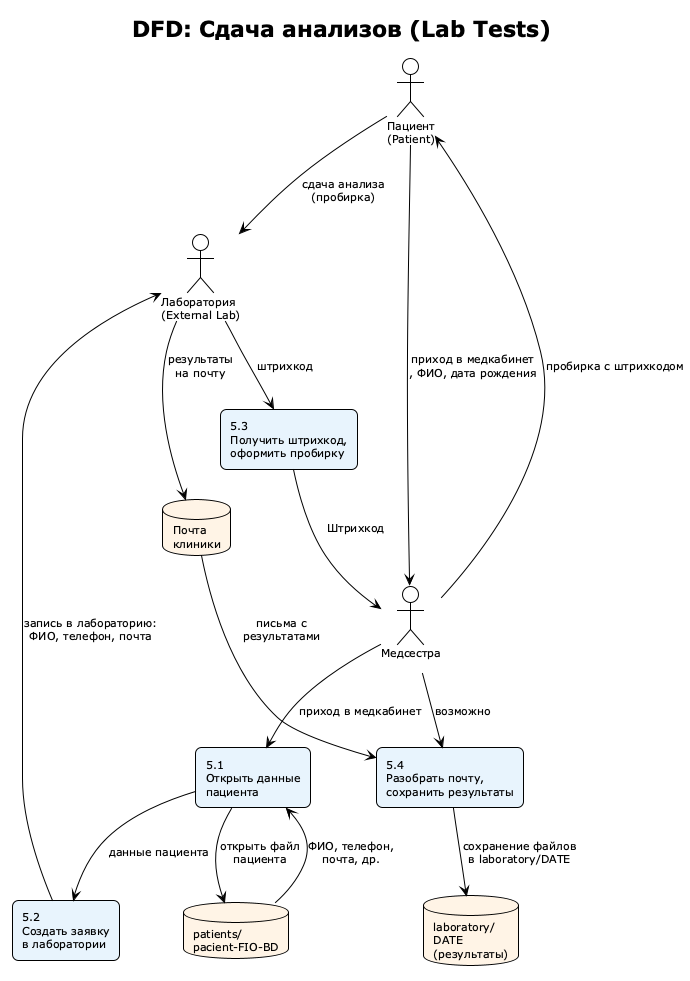
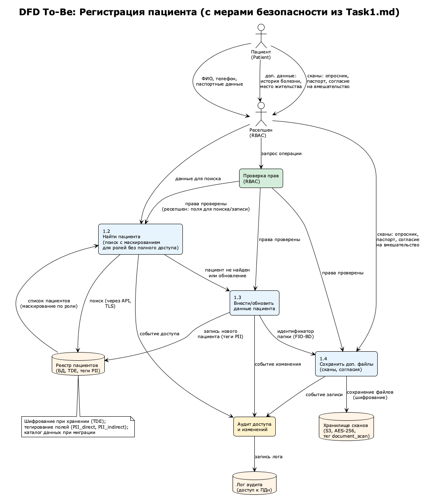
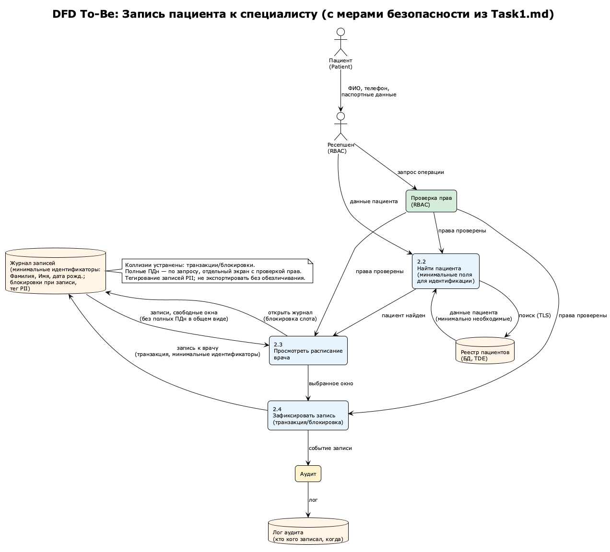
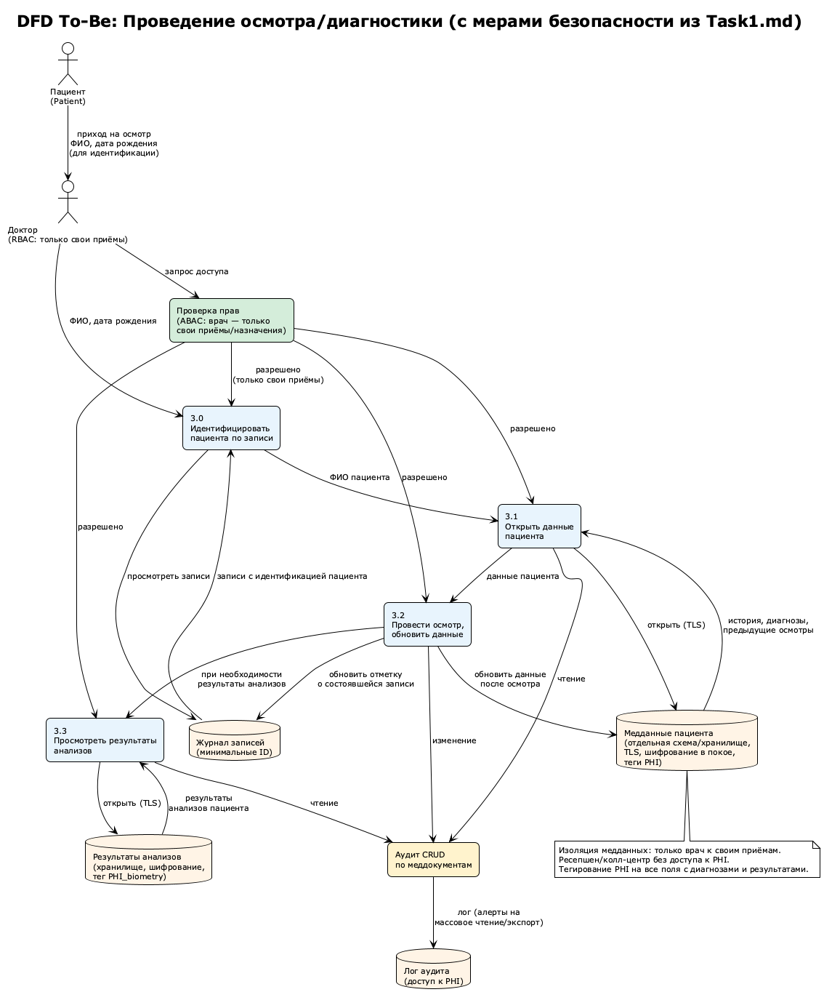
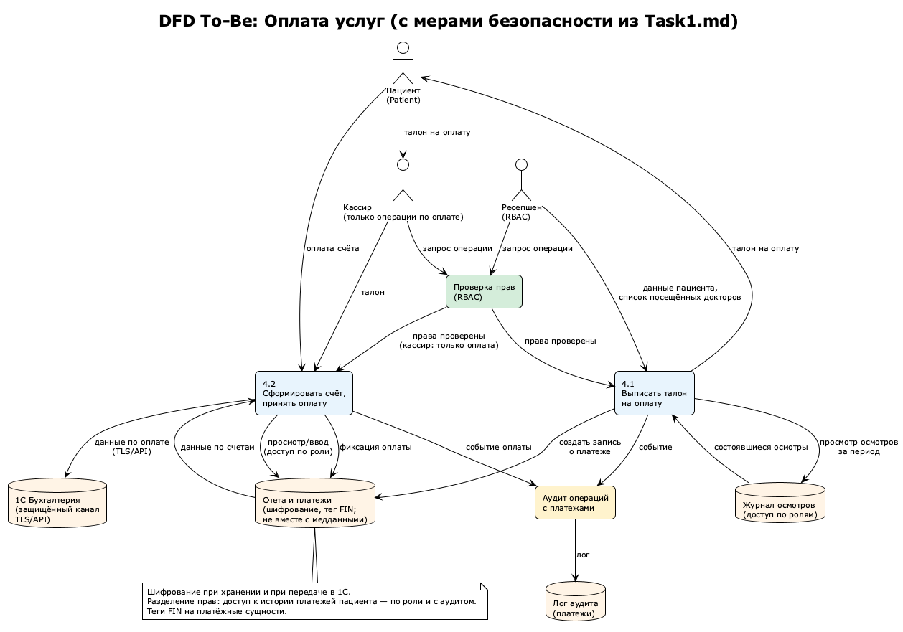
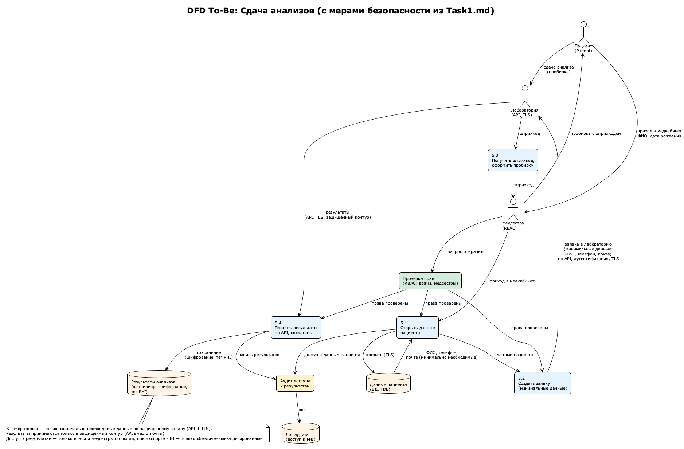

# Задание 1. Анализ безопасности системы
---
Чтобы заниматься реализацией новых продуктов, которые основаны на данных, необходимо системно решить проблему хранения конфиденциальных данных и управления ими. Сейчас данные лежат в непосредственной близости к пользователям, поэтому существует риск утечки данных и неправомерного использования информации.


Чтобы защитить данные, используйте механизмы, инструменты и принципы работы с конфиденциальными данными, например, подходы Privacy By Design, Data Minimization и Data Lineage.


В рамках этого задания вам нужно проанализировать состояние As-Is, чтобы впоследствии приступить к его доработке.
---


# Процессы работы с данными

Основные процессы работы с данными:
- Регистрация пациента, внесение дополнительных данных пациента
- Запись пациента к специалисту
- Оплата услуг
- Сдача анализов
- Проведение осмотра/диагностики в клинике

## Регистрация пациента
Процесс:

1. Пациент приходит в клинику, либо звонит по телефону
2. Пациент предоставляет свои основные данные (ФИО, телефон, паспортные данные)
3. Администратор ресепшен или колцентра открыват файл ```patients.xlsx``` на компьютере (из сетевой папки), просматривает файл, ищет пациента
4. Если пациент не найден, его данные вносятся в файл
5. Пациент может предоставить дополнительные данные (история болезни, место жительства и т.д.)
6. Администратор сохраняет доп. файлы (скан опросника, либо тестовый файл, скан паспорта, скан документа на согласие на медицинское вмешательство и тд) в отдельную папку ```patients/pacient-FIO-BD```
7. Пациент зарегистрирован



## Запись пациента к специалисту
Процесс: 
1. Пациент приходит в клинику, либо звонит по телефону
2. Пациент предоставляет свои основные данные (ФИО, телефон, паспортные данные)
3. Администратор ресепшен или колцентра открыват файл ```patients.xlsx``` на компьютере (из сетевой папки), просматривает файл, ищет пациента
4. Администратор открывает файл ```journals/doctor-fio```, просматривает записи ко врачу, ищет окно
5. Администратор фиксирует запись ко врачу по данным пациента (ФИО, номер телефона)



Проблемы:
- Нарушение целостности данных: коллизии при одновременной работе с журналом доктора (например два администратора запсиывают к одному доктору), данные могут быть потеряны/повреждены
- Персональные данные клиента в записи к доктору. Требуются для идентификации пациента, но

## Проведение осмотра/диагностики в клинике
Процесс:
1. Пациент приходит на осмотр к специалисту
2. Доктор открывает данные о пациенте ```patients/pacient-FIO-BD```
3. Доктор проводит осмотр и обновляет данные о пациенте ```patients/pacient-FIO-BD```
4. Для просмтора результатов анализов доктор просматривает папку с лабораторными результатами и ищет анализы пациента ```laboratory/DATE```



## Оплата услуг
Процесс:
1. Администратор ресепшен выписывает талон на оплату услуг в кассе
    - возможно просматривает журнал состоявшихся осмотров пациента за период ```journals/doctor-fio```???
    - возможно создает запись в excel папке ```bills/patient-fio.xlsx``` с платежами
2. Пациент с талоном обращается к кассиру
3. Кассир формирует счет и активирует оплату в кассе
    - возможно просматривает excel ```bills/patient-fio.xlsx```
    - возможно вносит вручную с бумажного талона
4. Пациент оплачивает счет
5. Данные по оплате отправляются в 1С



## Сдача анализов
Процесс
1. Пациент приходит в медкабинет
2. Медсестра открывает файл с данными пациента ```patients/pacient-FIO-BD```
3. Медсестра создает запись в лаборатории с указанием данных пациента (ФИО, номер телефона, почта)
4. В ответ от лабораторной системы получает штрихкод, печатает, клеит на пробирку
5. Пациент сдает анализ, пробирку отправляют в лабораторию
6. Лаборатория самостоятельно отправляет данные о результатах на почту
7. Возможно лаборатория отправляет данные о результатах клиники на общую почту клиники
8. Медсестра/другой ответственный сотрудник разбирает почту и сохраняет файлы в папку ```laboratory/DATE``` (дата получения результатов)



---
# 2. Аудит мер по обеспечению безопасности данных

## Cписок проблемных зон

- Нарушение принципа минимальных привилегий на чтение: администратор имеет доступ к медицинской информации любого пациента, доктор имеет доступ к данным не своих пациентов (нарушение врачебной тайны)
- Все данные хранятся в открытом виде, не шифруются, легкий доступ к чтению, скачиваю, риск утечки
- Отсутствие следов для аудита: невозможно узнать кто открывал файл, скачивал (редактирование, создание под вопросом, в зависимости от учетных записей и фиксации в операционной системе)
- Высокий риски нарушения целостности данных: при одновременной работе с общим файлом (список пациентов, список записей к доктору) данные могут быть потеряны или повреждены

Более подробно см. [problems.audit.md](problems.audit.md)

# 3. Список мер для улучшения безопаности данных

Для защиты данных будем использовать:
- **шифрование** (защита при хранении и передаче)
    - **при хранении**: TDE (Transparent Data Encryption) в PostgreSQL для таблиц с PII/медицинскими данными.
    - **На уровне приложения**: Шифрование отдельных полей (например, паспортных данных) с использованием ключей, управляемых через KMS.
    - **Файловое хранилище**: Шифрование сканов документов в S3-совместимом хранилище (AES-256).
    - **Передача**: TLS 1.3 для всех API-вызовов и веб-трафика.
- **обфускацию** (маскирование/токенизация для ограничения видимости)
    - **Динамическое маскирование** в UI: Для ролей с ограниченным доступом
    - **Постоянное маскирование** в тестовых средах: Замена реальных данных на реалистичные, но фейковые.
    - **Частичное скрытие**: Отображение только последних 4 цифр телефона или первых букв email.
- **обезличивание** (удаление или замена идентификаторов для аналитики и тестов)
    - **агрегация** данных (например, возрастные группы вместо точной даты рождения)
    - **псевдонимизация**: Замена прямых идентификаторов на уникальные случайные ID, где связь хранится в отдельном зашифрованном хранилище.
    - **удаление прямых идентификаторов** при экспорте данных для аналитики.
- дополнительно:
    - **Токенизация** для платёжных данных: Хранение токенов вместо реальных номеров карт.
    - **RBAC/ABAC**: Строгое управление доступом на основе ролей и атрибутов.
    - **Аудит и логирование**: Все запросы к защищённым данным фиксируются с привязкой к пользователю и временной метке.
    - **Водяные знаки** для просмотра сканов: Динамическое наложение водяного знака с ID сотрудника при открытии документа.
    - **Автоматическое удаление** по истечении сроков хранения (например, временные файлы анализов).
Классификация данных по категориям (PII, PHI, FIN и т.д.), методы защиты по категориям, схема тегов (type, purpose, retention) и реестр инструментов — см. [Task3/Task3.md](../Task3/Task3.md).


| Категория данных                         | Конкретные примеры данных                                                              | Уровень чувствительности              | Предлагаемые методы защиты                                                                                     | Обоснование                                                                                          |
|------------------------------------------|----------------------------------------------------------------------------------------|---------------------------------------|----------------------------------------------------------------------------------------------------------------|------------------------------------------------------------------------------------------------------|
| **Прямые идентификаторы личности**       | ФИО, номер паспорта, серия паспорта, СНИЛС, полис ОМС/ДМС, ИНН                         | Критический (PII)                     | **Шифрование** (при хранении), **обфускация** (при отображении), **обезличивание** (для аналитики)             | Прямая идентификация личности. Утечка ведёт к нарушению 152-ФЗ и репутационным потерям.              |
| **Косвенные идентификаторы**             | Дата рождения, телефон, email, адрес проживания, место работы/учёбы                    | Высокий (PII)                         | **Шифрование** (контактные данные), **обфускация** (частичное скрытие), **обезличивание** (для аналитики)      | В комбинации позволяют идентифицировать человека. Необходимы для коммуникации, но требуют защиты.    |
| **Медицинские данные (врачебная тайна)** | Диагнозы, история болезни, назначения, жалобы, заключения врачей, эпикризы             | Критический (медицинская тайна)       | **Шифрование** (при хранении и передаче), **строгий RBAC/ABAC**                                                | Защита врачебной тайны (ст. 13 ФЗ «Об основах охраны здоровья»). Доступ — только для лечащих врачей. |
| **Биометрические/лабораторные данные**   | Результаты анализов (кровь, моча), снимки (МРТ, КТ, рентген), ЭКГ, генетические данные | Критический (особые категории данных) | **Шифрование** (файлы и метаданные), **токенизация** ссылок, **обезличивание** (для исследований)              | Особые категории персональных данных (ст. 10 152-ФЗ). Высокий риск при утечке.                       |
| **Сканы документов**                     | Скан паспорта, сканы полисов, подписанные согласия, договоры                           | Критический                           | **Шифрование** (файловое хранилище), **водяные знаки** при просмотре, **логирование доступа**                  | Содержат всю PII в концентрированном виде. Частая цель утечек.                                       |
| **Финансовые/платёжные данные**          | Реквизиты карт, платёжные истории, суммы оплат, данные договоров                       | Высокий (ПДн + финансы)               | **Шифрование** (транзакционные данные), **токенизация** (платёжные реквизиты)| Требования платёжных систем и защиты финансовых операций.                                            |
| **Данные для коммуникации**              | Телефон для SMS, email для рассылок                                                    | Средний                               | **Шифрование** (контакты), **обфускация** в интерфейсе (an**zer@gmail.com), **возможность отзыва согласия**    | Необходимы для работы сервиса, но риск спама/фишинга при утечке.                                     |
| **Метаданные и системные данные**        | ID пациента, даты записей, филиал, идентификаторы врачей, логи доступа                 | Низкий/Средний                        | **Обезличивание** (для аналитики), **логирование и аудит** (полные данные), **ограничение доступа** (админы)   | Могут стать косвенными идентификаторами в комбинации. Важны для аудита безопасности.                 |
| **Данные для аналитики (BI/ML/AI)**      | Обезличенные медицинские истории, статистика заболеваний, агрегированные данные        | Низкий (после обезличивания)          | **Обезличивание**, **агрегация**, **псевдонимизация**                                                          | Позволяет использовать данные для бизнес-анализа без риска идентификации.                            |
| **Данные кадрового учёта**               | ФИО сотрудников, должности, зарплаты, паспортные данные сотрудников                    | Высокий                               | **Шифрование**, **разграничение доступа** (HR, бухгалтерия), **отдельная база**                                | Внутренние данные компании, защищаемые трудовым законодательством.                                   |
| **Товарно-материальные ценности (ТМЦ)**  | Названия медикаментов, поставщики, закупочные цены, остатки                            | Средний                               | **Шифрование** (финансовые данные поставок), **разграничение доступа** (склад, бухгалтерия)                    | Коммерческая тайна, данные для внутреннего учёта.                                                    |

### Механизм тегирования данных с использованием инструментов тегирования

**Логика тэгирования:**
- **Тег при создании/поступлении данных:** каждый объект (запись пациента, файл, поле в БД) при создании или импорте получает один или несколько тегов (например, `type:PII_direct`, `retention:5y`).
- **Наследование и распространение:** при копировании или передаче данных в другой поток (лаборатория, 1С, отчёт) теги передаются вместе с метаданными, чтобы в точке назначения применялись те же ограничения.
- **Проверка при доступе и передаче:** перед выдачей данных пользователю или внешней системе проверяется соответствие тегов политике (например, запрос с тегом PHI разрешён только ролям «врач», «медсестра» для своего подразделения).

**Схема тегов (пример):**
- `type: PII_direct` - основная категория данных:
    - `PII_direct` - прямые идентификаторы человека,максимальная защита (ФИО, паспорт (номер, серия), СНИЛС, полис, ИНН, фото)
    - `PII_indirect` - косвенные идентифкаторы человека (Дата рождения, место рождения, телефон, email, адрес)
    - `PII_contact` - контактные данные, мене чувствительны чем остальные
    - `PHI` - медицинские данные (история болезни, диагнозы)
    - `PHI_biometry` - биометрические данные (анализы крови, рост/вес, ЭКГ, и другое)
    - `meta` - метаданные системы (номер записи, дата, ID пациента, дата создания записи, и другое)
    - `documet_scan` - сканы, особый класс, содержит всю чувствительную информацию в виде изображения. может включать как PII, так и PHI
- `purpose:identification` — цель использования
    - `identification` 
    - `treatment`
    - `communication`
    - `billing`
    - `achive` - архивное хранение по закону, например длительное хранение медкарт после завершения лечения
    - `legal` - для соблюдения законов, например подписанные согласия
- `retention:...` — срок хранения (для автоматического обезличивания/удаления) (сроки хранения медицинской информации и ПДн различаются)


**Инструменты тегирования:**
- **СУБД и платформы данных:** атрибуты/метки на уровне столбцов и строк (например, в PostgreSQL — отдельная таблица метаданных или расширение ```pg_label```)
- **На уровне приложения:** Аннотации в коде (например, ```@DataClassification(level=type.PII_direct```)) для автоматической проверки политик доступа.

- **Каталоги данных и Data Governance:** Apache Atlas, Collibra, Informatica — определение классификаций (PII, PHI), привязка к полям и пайплайнам, интеграция с политиками доступа и маскирования.
- **Интеграция в пайплайны:** при загрузке данных из Excel/файлов в будущую БД или озеро данных — автоматическое назначение тегов по имени поля или справочнику (например, поле «ФИО» → PII_direct, «диагноз» → PHI).

- **Проверка в CI/CD и мониторинг:** скрипты или политики (например, OPA, отдельные тесты), проверяющие, что тегированные данные не попадают в логи, не передаются в неразрешённые API и что новые поля с ПДн/медданными помечены тегами перед релизом.

В текущем AS-IS (Excel, файловые папки) тегирование в автоматическом виде недоступно; первым шагом является ведение реестра/справочника «какой файл/каталог какую категорию содержит» (ручное тегирование на уровне артефактов), с последующим переходом на тегирование в БД и каталоге при миграции в единую систему.

#  Изменения потоков данных
Ниже перечислены инструменты и меры по потокам: регистрация, запись к специалисту, осмотр/диагностика, оплата, сдача анализов.

**Регистрация пациента**
- Шифрование тома/файловой системы или шифрование на уровне приложения для каталогов с `patients.xlsx` и `patients/pacient-FIO-BD`; шифрование при передаче при переходе на веб/API.
- Разграничение доступа по ролям (ресепшен — только поля, нужные для поиска и записи; полные ПДн и сканы — ограниченный круг).
- Маскирование ПДн в интерфейсах (ФИО, телефон частично) для сотрудников без права «полный доступ».
- Аудит: логирование доступа и изменений к реестру пациентов и папкам с персональными/медданными.
- Тегирование: при миграции в БД — теги на поля и таблицы; каталог данных или реестр для файлов AS-IS.



**Запись пациента к специалисту:** журнал только с минимальными идентификаторами (ФИО, дата рождения); полные ПДн по запросу с проверкой прав; транзакции/блокировки при записи (устранение коллизий); аудит «кто кого записал».



**Проведение осмотра/диагностики:** изоляция медданных — только врач к своим приёмам; ресепшен/колл-центр без доступа к PHI; шифрование каталогов `patients/pacient-FIO-BD`, `laboratory/DATE`; аудит CRUD по меддокументам.



**Оплата услуг:** шифрование `bills/`, защищённый канал до 1С (TLS/API); кассир — только операции по оплате; теги FIN; не хранить платёжные данные вместе с медданными. Интеграция с 1С см. [README.md](../README.md).



**Сдача анализов:** в лабораторию — только минимальные данные по API + TLS (вместо почты); приём результатов в защищённый контур (API); тег PHI для результатов; доступ только врачи/медсёстры.



**Общие меры для всех потоков:** DLP (почта, USB, веб); пересмотр прав и каталога данных; политика хранения и удаления по тегам и целям (детали — Task3).