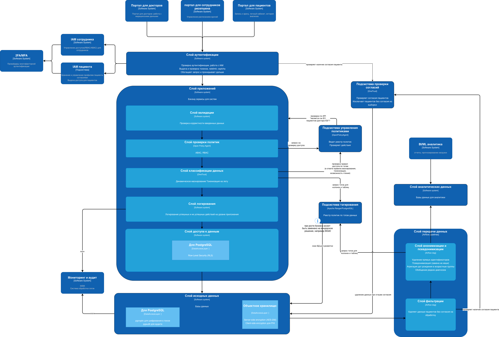
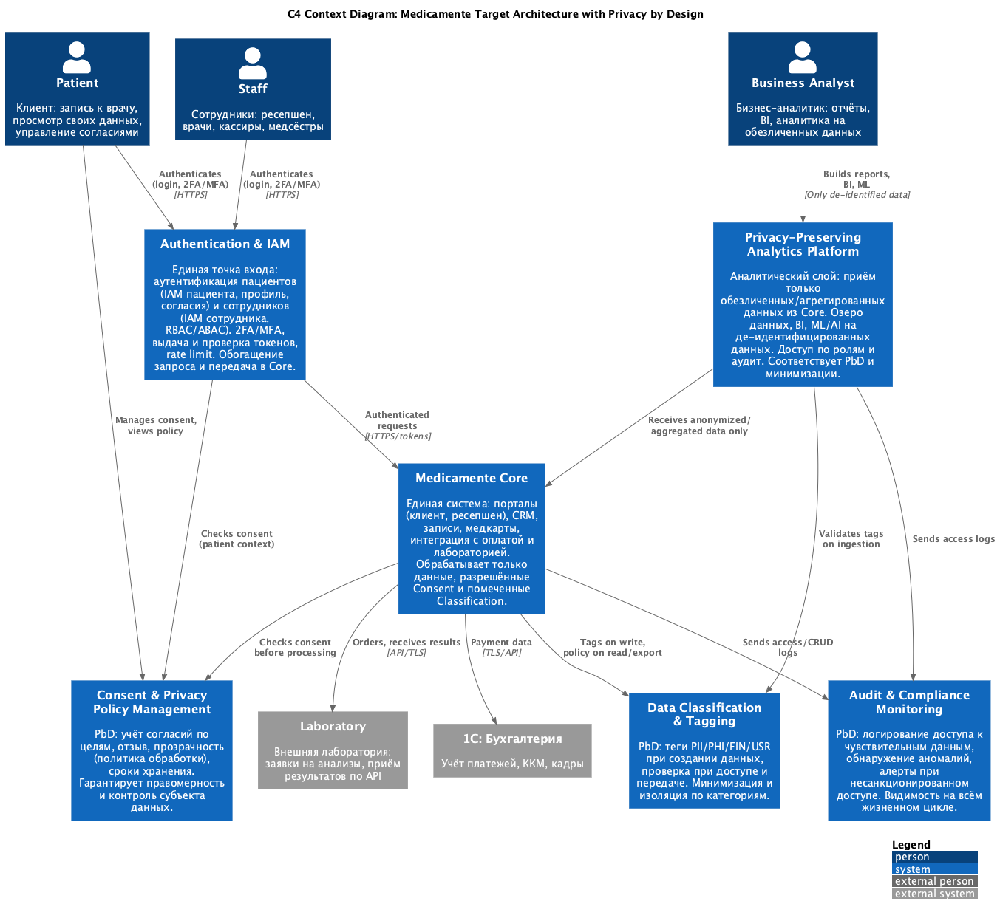

# Описание концептуальной архитектуры (по диаграмме Task2.drawio)

---

Архитектура представлена в виде концептуальных **слоёв** для будущих порталов: от пользовательских порталов до хранилищ данных и пайплайнов передачи. При этом концепт не отражает разделение слоя приложений по доменам, разделение баз данных и так далее. Предполагается, что при разделении сервисов по DDD концепт слоев будет распространен на все подсистемы и приложения. 

---

# Описание архитектуры слоев

## 1. Слой приложений (пользовательские системы)

Три портала обращаются к общему **слою аутентификации**:

| Система | Назначение |
|--------|------------|
| **Портал для докторов** | Работа с медицинскими данными |
| **Портал для пациентов** | Запись к врачу, личный кабинет, история анализов |
| **Портал для сотрудников ресепшена** | Управление расписанием врачей |

Все три портала направляют запросы в **Слой аутентификации**, который далее передаёт их в **Слой приложений** (бэкенд-сервисы для систем).

## 2. Слой аутентификации и IAM

**Слой аутентификации** — единая точка входа после порталов:
- Проверка аутентификации, работа с IAM
- Выдача и проверка токенов, ratelimit, captcha
- Обогащение запроса и передача его дальше

Он взаимодействует с:
- **IAM сотрудника** — управление доступом (RBAC/ABAC) для сотрудников; слой аутентификации обращается к нему за проверкой прав
- **IAM пациента** — хранение и управление профилем пациента и согласиями, выдача доступа для пациентов
- **2FA/МFA** — провайдеры многофакторной аутентификации (к IAM сотрудника и IAM пациента)
- **Подсистема проверки согласий** — слой аутентификации проверяет наличие согласия пациента перед дальнейшей обработкой

После проверки запрос направляется в **Слой приложений** (бэкенд, сервисы).

## 3. Слой приложений (бэкенд)

**Слой приложений** — бэкенд-сервисы для всех порталов. Получает обогащённые запросы от слоя аутентификации. На диаграмме от него идут связи к **Подсистеме управления политиками** (проверки по API вида «ID1 role doctor get_patient_data Patient_ID2»).

## 4. Обработка запросов: валидация, политики, классификация данных

Внутри контура обработки запросов выделены последовательные слои:

1. **Слой валидации** — проверка корректности введённых данных. Передаёт запрос в **Слой проверки политик**.

2. **Слой проверки политик** (Open Policy Agent) — ABAC, RBAC. Передаёт запрос в **Слой классификации данных**.

3. **Слой классификации данных**  — динамическое маскирование и токенизация на лету. Он:
   - Запрашивает у **Подсистемы тегирования** теги для колонок и таблиц
   - Запрашивает у **Подсистемы управления политиками** проверку правил доступа по тегам (в ответе — правила маскирования, токенизации, возможность чтения)
   - После получения, либо во время (при формировании запроса) данных трансформирует их  по полученным правилам, либо выдает отказ в доступе
   - Передаёт данные в **Слой логирования**
   

4. **Подсистема управления политиками** (Open Policy Agent) — ведёт реестр политик, проверяет действия. Получает от слоя проверки политик запрос на проверку доступа и отдаёт результаты проверок в слой приложений (по API). 

5. **Подсистема тегирования** (Apache Ranger / PostgreSQL) — реестр политик по тегам данных. Получает от слоя классификации запросы на теги колонок и таблиц; выполняет скан БД для разметки. 

## 5. Слой логирования

**Слой логирования** — логирование успешных и неуспешных действий на уровне приложения. Получает данные от слоя классификации данных и передаёт логи в **Мониторинг и аудит**.
Регистрирует через себя все решения по доступу к данным: кто, с какой политикой, какие данные запрашивает в результате

## 6. Слой доступа к данным и слой исходных данных

**Слой доступа к данным** получает от слоя классификации данных уже обработанные (с учётом масок и тегов) запросы и обращается к **Слою исходных данных** (базы данных).

В слое доступа к данным используются механизмы:
- **PostgreSQL** — и для других другие базы данных для хранения структурированной информации, обязателен Row-Level Security (RLS)

В **слое исходных данных** также указаны компоненты хранения:
- **PostgreSQL** — pgcrypto для шифрования в покое, pgaudit для аудита
- **Объектное хранилище** — server-side encryption (AES-256), client-side encryption для PHI (сканы, файлы)

**Слой исходных данных** отдаёт логи в **Мониторинг и аудит** (SIEM, система обработки логов).

## 7. Слой передачи данных (Airflow) и аналитический контур

**Слой передачи данных** представлен как слой **Airflow pipelines**. В него входят:

- **Слой фильтрации** (Airflow DAG) — удаляет данные пациентов без согласия на обработку. Читает из слоя исходных данных, проверяет наличие согласия пациента через **Подсистему проверки согласий**, передаёт данные в **Слой анонимизации и псевдонимизации**.

- **Слой анонимизации и псевдонимизации** (Airflow DAG):
  - Удаление прямых идентификаторов
  - Псевдонимизация (замена на хеши)
  - Агрегация дат рождения в возрастные группы
  - Обобщение редких диагнозов  
  Запрашивает теги для колонок и таблиц у подсистемы тегирования, передаёт результат в **Слой аналитических данных** и логи — в слой логирования.

- **Слой аналитических данных** — базы данных для аналитики. Потребляется системой **BI/ML аналитика** (отчёты, прогнозирование нагрузки, инструменты визуализаци).

**Подсистема проверки согласий** при отзыве согласия инициирует удаление данных (связь «удаление данных при отзыве согласия» со слоем исходных данных).