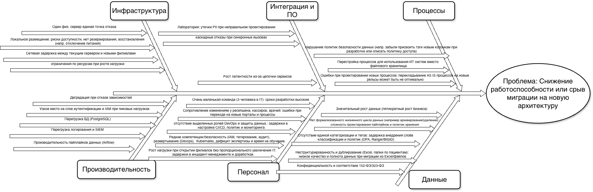

# Задание 4. Оценка узких мест при миграции

В компании планируется миграция устаревшей монолитной системы на современную архитектуру (например, на микросервисную). В процессе перехода необходимо выявить потенциально узкие места, которые могут негативно повлиять на работоспособность нового решения.

---

## 1. Анализ ситуации

### Текущее состояние (As-Is)

- **Масштаб:** один офис, 20 административных и 15 медицинских сотрудников; планируется пятикратный рост объёма данных и открытие филиалов.
- **Данные и процессы:** журналы приёма, учёт пациентов и платежей, медкарты, анализы — в Excel и сканах на общем диске. Учёт денег — в «1С:Бухгалтерия» (файловый режим), ТМЦ — в «1С:Торговля и склад». ККМ интегрированы с 1С.
- **Инфраструктура:** один физический сервер (Windows Server 2022) в здании офиса: Active Directory, DNS, DHCP, LDAP, файловый сервер, Exchange. Бэкэнд как таковой отсутствует, все ведется в ручном режиме.
- **Безопасность:** доменная аутентификация; разграничения доступа к данным и аудита на уровне приложений нет. PII/PHI в файлах без шифрования и тегирования; соответствие 152-ФЗ, 323-ФЗ, ФСТЭК не обеспечено.

### Цели миграции (To-Be)

- Единая система хранения и управления данными (портал клиентов, портал ресепшена, платёжный шлюз, CRM, интеграция с лабораторией).
- MVP: запись на приём через портал, видимость записи для ресепшена, RBAC/ABAC по категориям данных.
- Целевое состояние: полная автоматизация записи, мобильное приложение, тегирование данных, аудит доступа, алертинг при несанкционированном доступе.
- НФТ: безопасность (конфиденциальность, своевременное удаление данных), масштабируемость (филиалы, рост команды, мобильные клиенты), сопровождаемость, конфигурируемость.
- Дополнительно: интеграция лаборатории по API с контролем конфиденциальных данных; озеро данных для BI/ML/AI.
---

## 2. Ключевые процессы и компоненты, затрагиваемые миграцией

| Область | Компоненты / процессы | Затрагивание миграцией |
|--------|------------------------|-------------------------|
| **Бизнес-логика** | Регистрация пациента, запись к специалисту, осмотр/диагностика, оплата, сдача/получение анализов | Перенос из Excel/файлов в сервисы; введение ролей и политик доступа (RBAC/ABAC) |
| **Базы данных** | Excel, сетевые папки, файловые базы 1С | Миграция в PostgreSQL (транзакционные данные), объектное хранилище (сканы), возможное выделение аналитического хранилища; RLS, шифрование, аудит |
| **Коммуникационные каналы** | Локальная сеть, 1С, почта (лаборатория), будущие API | Замена на API (REST), очереди; TLS, аутентификация сервисов; интеграция лаборатории по API |
| **Серверное оборудование и инфраструктура** | Один физический сервер (AD, DNS, DHCP, LDAP, файлы, Exchange, бэкенды) | Переход на облако или ЦОД, Kubernetes/контейнеры, разделение сервисов; возможный гибрид с сохранением 1С на текущем железе |
| **Идентификация и доступ** | Доменная аутентификация, общие папки | IAM сотрудника и пациента, 2FA/MFA, слой аутентификации, подсистема согласий |
| **Интеграции** | 1С (бухгалтерия, ТМЦ), ККМ, лаборатория (ручной перенос/почта) | Сохранение интеграции с 1С при миграции учёта приёма/пациентов; платёжный шлюз; API лаборатории с контролем PII/PHI |
| **Данные и конфиденциальность** | Файлы пациентов, журналы, счета, результаты анализов | Тегирование, маскирование, токенизация, политики (OPA), подсистема тегирования (Ranger/BIGID), пайплайны обезличивания (Airflow) |
| **Наблюдаемость и контроль** | Отсутствуют централизованные логи и аудит | Логирование, SIEM, мониторинг, алертинг при доступе к чувствительным данным |

---

## 3. Диаграмма Исикавы

## 4. Рекомендации (меры по устранению узких мест)

- **Инфраструктура:** вынести критичные сервисы в облако/ЦОД с несколькими зонами; развернуть сервисы в Kubernates кластере; внедрить балансировку (nginx, kong), service-mash (istio); внедрить автомасштабирование.

- **Программное обеспечение:**  автоматические проверки наличия тэгов и политик в пайплайне.

- **Интеграция и ПО:** спроектировать микросервисы с учетом bounded context; сократить длину цепочки (кэш политик, асинхронные шаги где возможно); для лаборатории разработать отдельный API-шлюз с контролем PII/PHI и fallback-сценариями; ввести асинхронную коммуникацию (очереди) для не критичных по задержке потоков; зафиксировать политики retry/backoff и таймаутов.  
- **Персонал:** заложить время на обучение (K8s, безопасность данных, IAM); при необходимости привлечь внешних экспертов, нанять DevOps, аналитиков по данным; провести пилоты с ресепшеном/кассирами и докторами.
- **Процессы:** проанализировать текущие процессы, выявить избыточные/небезопасные, перепроектировать для использования веб систем; внедрить проверку корректности политик и тэгов в CI/CD: например проверять все ли данные получили тэги и политику.  
- **Данные:** провести инвентаризацию и очистку данных перед миграцией (детали — в [Task5/cutover-plan.md](../Task5/cutover-plan.md), этап «Подготовка данных»); описать жизненный цикл данных и политики хранения/удаления; определить модель категорий и тегов до старта миграции (классификация — [Task3/Task3.md](../Task3/Task3.md)); спроектировать партиционирование и архивацию для растущего объёма; внедрить IAM, тегирование, маскирование, аудит доступа и подсистему согласий

---

## 5. Приоритетность мер

| Приоритет | Проблема | Мера | Обоснование |
|-----------|----------|------|-------------|
| **1** | Единая точка отказа, отсутствие резервирования | Перенос критичных компонентов в отказоустойчиую среду (облако/ЦОД), резервирование и мониторинг | Без этого любой сбой сервера останавливает работу клиники. |
| **1** | Конфиденциальность и соответствие 152-ФЗ/323-ФЗ | Внедрение IAM, тегирования, маскирования, аудита доступа и подсистемы согласий в MVP | Репутационные и регуляторные риски; требование ТЗ. |
| **1** | Целостность и полнота данных при миграции | Инвентаризация и очистка данных | Потеря или порча данных недопустима в мед. учреждении. |
| **2** | Длинная цепочка и латентность | Сокращение синхронных шагов, кэширование политик, асинхронные пайплайны где возможно | Влияет на отзывчивость порталов и мобильного приложения. |
| **2** | Интеграция с лабораторией | API-шлюз с контролем PII/PHI и fallback-сценариями| Критично для операционной деятельности и качества сервиса. |
| **2** | Перегрузка и компетенции IT | План обучения, привлечение/найм, пилоты с пользователями | Снижает риск срыва сроков и ошибок при переходе. |
| **3** | Отказоустойчивость интеграций | Контракты, retry/таймауты, по возможности асинхронные очереди | Важно для стабильности при росте числа сервисов и филиалов. |
| **3** | Нарушение политик безопасности данных  | Автоматические проверки в пайплайне и практики отката | Снижает риск нарушений политик и человеческого фактора |
| **3** | Жизненный цикл данных и реестр согласий | Документирование и автоматизация удаления/архивации по согласию | Нужно для долгосрочного соответствия и масштабирования BI/ML. |

---

## 6. Риски снижения производительности системы

В таблице описаны подробно основные риски, которые влияют именно на произвоидтельность системы

| Риск | Описание | Что можно сделать |
|------|----------|----------------|
| **Рост латентности из-за цепочки сервисов** | Каждый запрос проходит аутентификацию, валидацию, OPA, классификацию данных, доступ к БД. Суммарная задержка и пиковые нагрузки могут дать неприемлемое время отклика. | Кэширование результатов проверки политик и тегов; сокращение синхронных вызовов; размещение критичных сервисов в одной зоне/регионе; нагрузочное тестирование с целевыми SLA. |
| **Узкое место на слое аутентификации и IAM** | Единая точка входа для всех порталов. При росте числа пользователей и филиалов возможны задержки и отказы при пиках (запись на приём, утро понедельника). | Горизонтальное масштабирование и балансировка слоя аутентификации; кэш сессий/токенов; rate limiting и приоритизация запросов; мониторинг и алерты по задержкам и ошибкам. |
| **Перегрузка БД (PostgreSQL)** | Одна БД для транзакционных данных, RLS, аудит, рост объёма в 5 раз и новые сценарии (мобильные клиенты, отчёты). | Партиционирование и индексы под типовые запросы; разделение чтения и записи (реплики для чтения); вынос тяжёлых отчётов в аналитическое хранилище; мониторинг медленных запросов и блокировок. |
| **Деградация при отказе зависимостей** | Падение IAM, OPA, подсистемы тегирования или БД приводит к недоступности или задержкам всего потока. | Резервирование и health checks для всех критичных сервисов; circuit breaker и таймауты на вызовах; деградированный режим (только чтение, без обогащения политик) где допустимо по политике безопасности; регулярные chaos-тесты. |
| **Производительность пайплайнов данных (Airflow)** | Фильтрация по согласию и анонимизация выполняются по расписанию; при росте объёма окна обработки могут накладываться или не успевать. | Партиционирование DAG по датам/филиалам; увеличение воркеров и ресурсов; приоритизация пайплайнов; мониторинг длительности и очередей задач. |
| **Сетевые задержки между филиалами и центром** | Запросы из филиалов к центральным API и БД дают большую RTT; возможны таймауты и нестабильность. | Кэширование и реплики данных в регионе филиала где допустимо; CDN/кэш для статики и справочников; ограничение синхронных кросс-регионных вызовов; определение допустимой задержки и проектирование под неё. |
| **Перегрузка логирования и SIEM** | Высокий объём логов от всех слоёв при росте трафика может замедлять приложение и переполнять хранилище логов. | Буферизация и асинхронная запись логов; семплирование и агрегация где допустимо; отдельный канал и хранилище для логов с ротацией и архивацией; мониторинг задержек записи и объёма. |
